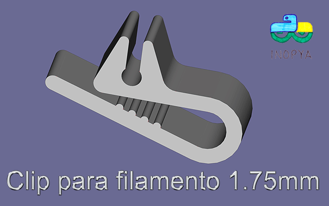
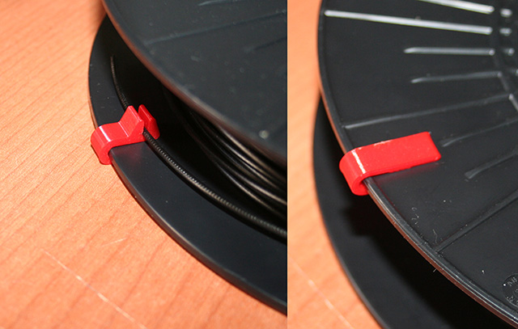
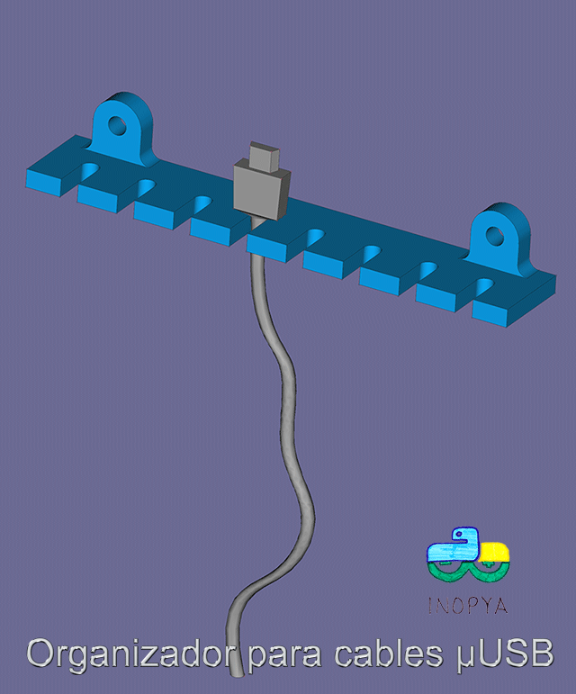
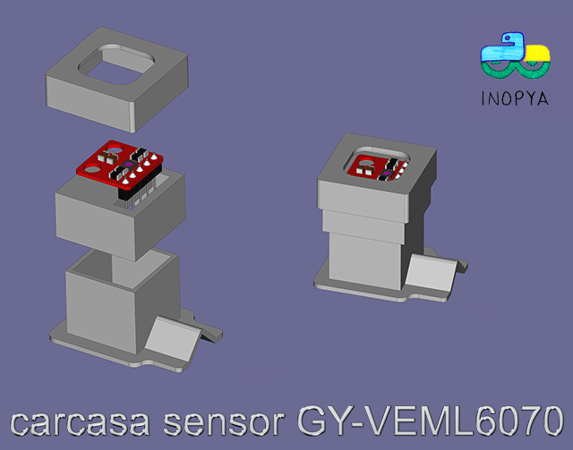
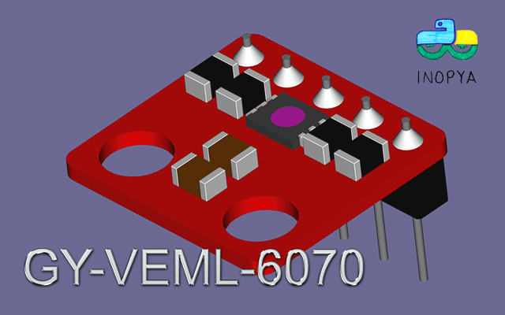
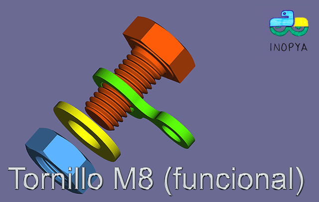
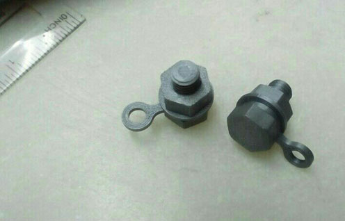
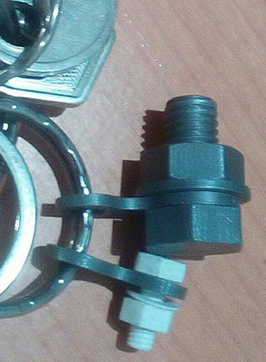

# FREECAD
***piezas freecad*** 

## Clip para filamento 3D de 1.75mm (vesion minimalista)

## Organizador para cables micro USB

## Carcasa par sensor UV GY-VEML7060 u otros similares de hasta 5 pines

## Sensor GY-VEML7060 (para usar en ejemplos de montajes)

## Tornillos M4 y M8 funcionales usados como llaveros

